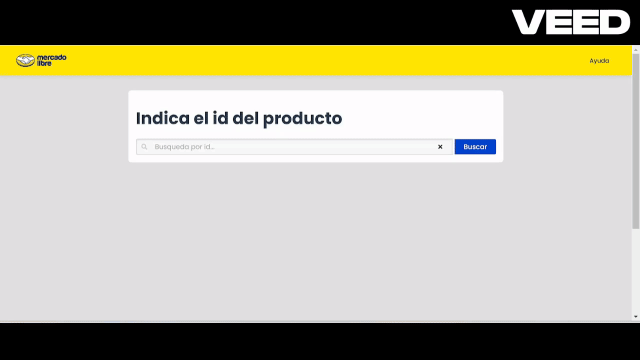
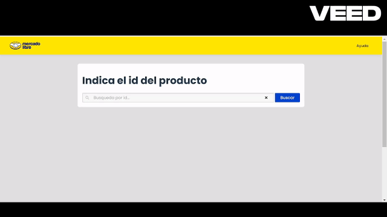
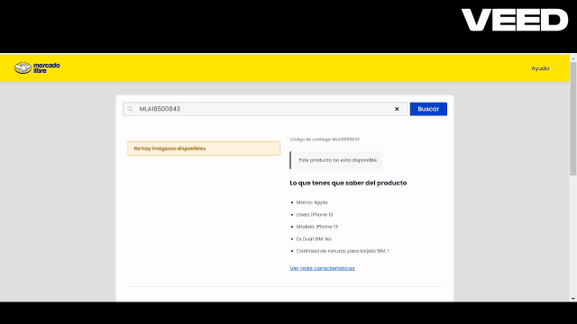

# Prueba Práctica de Frontend para Mercado Libre

## 🚀 Producción

### 🌐 Frontend

- **URL Producción VERCEL Frontend:** [🔗 Enlace al Frontend](https://mercadolibre-frontend-test-xi.vercel.app)

### 🖥️ Backend

- **URL Producción RAILWAY Backend:** [🔗 Enlace al Backend](https://mercadolibre-frontend-test-production.up.railway.app)

## STACK TECNOLOGICO

<div align="center">
  <a href="">
    
    
    
    
    
    
  </a>
</div>

## 🛠️ Acerca del Proyecto

Esta aplicación web para Mercado Libre permite ingresar un ID de producto y obtener la siguiente información:

- **Categorías del producto**.
- **Estado del producto** (disponible/no disponible).
- **Imagenes del producto**.
- **Precio** del producto.
- **Descripción** detallada del producto.

La aplicación está diseñada para facilitar la búsqueda y consulta de información de productos de Mercado Libre utilizando su API pública.

---

## 🟢 PRODUCTO DISPONIBLE

[](doc/gif-n/nombre-del-gif.gif)

## 🔴 PRODUCTO NO DISPONIBLE

[](doc/gif-n/nombre-del-gif.gif)

## 🟡 PRODUCTO NO DISPONIBLE CON VARIANTES

[](doc/gif-n/nombre-del-gif.gif)

### 🔧 Construido Con

Este proyecto está construido con las siguientes tecnologías:

- **[React.js](https://reactjs.org/)**
- **[TypeScript](https://www.typescriptlang.org/)**
- **[Express.js](https://expressjs.com/)**
- **[Webpack](https://webpack.js.org/)**
- **[Jest](https://jestjs.io/)**
- **[Vite](https://vitejs.dev/)**
- **[Sass](https://sass-lang.com)**

---

## 🚀 Primeros Pasos

### Requisitos

Asegúrate de tener Node.js >= 20 instalado. Luego, instala npm:

```sh
npm install npm@latest -g
```

Clona el repositorio:

```sh
https://github.com/brunfernandez98/mercadolibre-frontend-test
```

Navega a la carpeta del frontend:

```sh
cd frontend
```

Instala las dependencias:

```sh
npm install
```

Compilar el proyect frontend:

```sh
npm run build
```

## Configuración de Variables de Entorno Frontend

```env
VITE_BASE_URL=
VITE_API_KEY=
```

### `VITE_BASE_URL`

- **Descripción**: Esta variable define la URL base del servidor backend con la que el frontend interactúa. El servidor esta utilizando la versión `v1` de la API.
- **Uso**: Se utiliza en las solicitudes HTTP para construir la URL completa al interactuar con los endpoints de la API. En lugar de escribir la URL manualmente en cada petición, puedes usar esta variable de entorno para que el código sea más flexible y fácil de mantener.

### `VITE_API_KEY`

- **Descripción**: Esta variable almacena la clave API utilizada para autenticar las solicitudes realizadas desde el frontend hacia la API.

- **Uso**: La clave API se pasa en los encabezados de las solicitudes HTTP para autenticar las peticiones al servidor o a una API externa.

## Configuración de Variables de Entorno BACKEND

```env
PORT=3000
BASE_URL=
MERCADO_LIBRE_API_URL=
ACCESS_TOKEN=
API_KEY=
FRONTEND_URL=
```

### `PORT`

- **Descripción**: Esta variable define el puerto en el que el servidor backend estará escuchando peticiones.

- **Uso**: El puerto se utiliza al iniciar el servidor para indicar en qué puerto correrá la aplicación, por defect es el puerto 3000, localhost:3000.

### `BASE URL`

- **Descripción**:
  Almacena la URL base utilizada para realizar solicitudes, aca de define la version de la API.

- **Uso**: Se utiliza en las llamadas a la API para concatenar los endpoints específicos, facilitando la configuración en diferentes entornos (desarrollo, producción, etc.).

## MERCADO_LIBRE_API_URL

- **Descripción**: Esta variable contiene la URL de la API de Mercado Libre, donde se harán las peticiones de productos y otros datos necesarios.

- **Uso**: Se utiliza para realizar solicitudes HTTP a la API de Mercado Libre, obteniendo datos como detalles de productos, precios, etc.

## ACCESS_TOKEN

- **Descripción**: Almacena el token de acceso necesario para autenticar las peticiones a la API de Mercado Libre.

- **Uso**: Este token se incluye en los encabezados de las solicitudes HTTP para validar la autenticidad de las peticiones hacia mercado libre.

## API_KEY

- **Descripción**: Almacena el token de acceso necesario para autenticar las peticiones hacia el backend.

- **Uso**: Este token se incluye en los encabezados de las solicitudes HTTP para validar la autenticidad de las peticiones hacia el backeend.

## FRONTEND_URL

- **Descripción**: Contiene la URL del frontend de la aplicación que será utilizada en la configuración de CORS.

- **Uso**: El backend utiliza esta URL para permitir que el frontend realice peticiones al servidor, evitando problemas de CORS al definir qué orígenes son permitidos.

## BASE URL

Base url: `https://mercadolibre-frontend-test-xi.vercel.app/`

```bash
  GET /api/products/:productID
```

| Parameter  | Type   | Description            | Required |
| ---------- | ------ | ---------------------- | -------- |
| product_id | string | Id of product to fetch | Yes      |

# Justificación de llamadas a la API MERCADO LIBRE

1. Obtención de **Bearer Token**: En los primeros pasos de la interacción con la API de MercadoLibre, hizo la autenticación para obtener un Bearer token, el cual es necesario para autenticar las siguientes solicitudes. Esto asegura que las llamadas a la API estén autorizadas y ademas se agrego un refresh token en postman en caso que se invalide.

2. Utilicé este token para hacer una llamada al endpoint de productos con el **product_id**, lo que me permite obtener los detalles del producto específico que estoy mostrando en la interfaz.

3. Llamada a categorías para **Breadcrumb**: Con el fin de mejorar la experiencia del usuario y proporcionar una mejor navegación en la página, realicé una segunda llamada utilizando el item_id del producto obtenido. Esta llamada está dirigida a las categorías del producto para construir un breadcrumb dinámico.

4. Verificación de **buy_box_winner**: En esta parte del proceso, hice una verificación del campo buy_box_winner para determinar si el producto está disponible o si su estado es inactivo. En caso de que el producto no esté disponible o su estado sea "inactivo", evalúo si existe otra variante del producto que esté activa.
